# git管理スタート
- `git init` : .gitディレクトリ(ローカルリポジトリ)が隠しフォルダとして生成される. とりあえずGit管理したいディレクトリに移動したらはじめにこれをする.

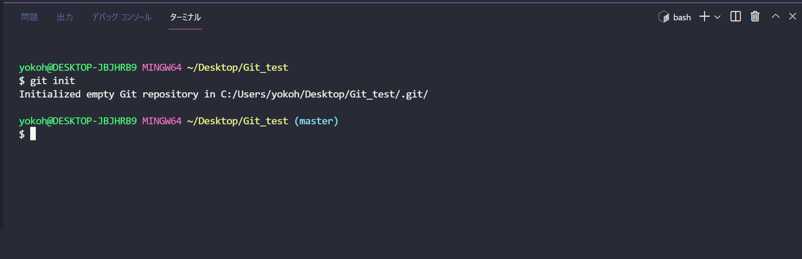

# ファイルやフォルダをステージ
Gitにあげる前にどんなファイルやフォルダをあげるかを指定する作業.
- `git add <ファイル名>` : ファイルの変更をステージ
- `git add <ディレクトリ名>` : ディレクトリの変更をステージ
- `git add .` : 全ての変更をステージ
- `git status` : 変更内容について確認できる

実際にtest.txtをステージすると以下のようになり, statusを確認してみると確かにステージに上げた変更点がわかる.
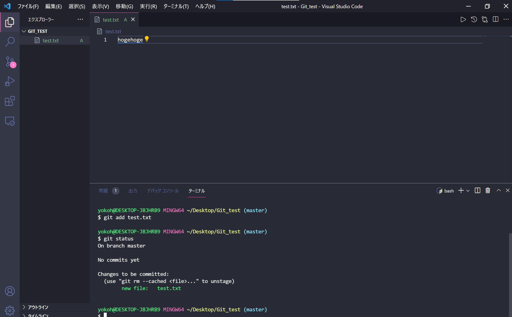

この作業をコマンドで行うのではなく, VSCodeのGitHub拡張機能を用いて行うのであれば以下の画像のようになる.
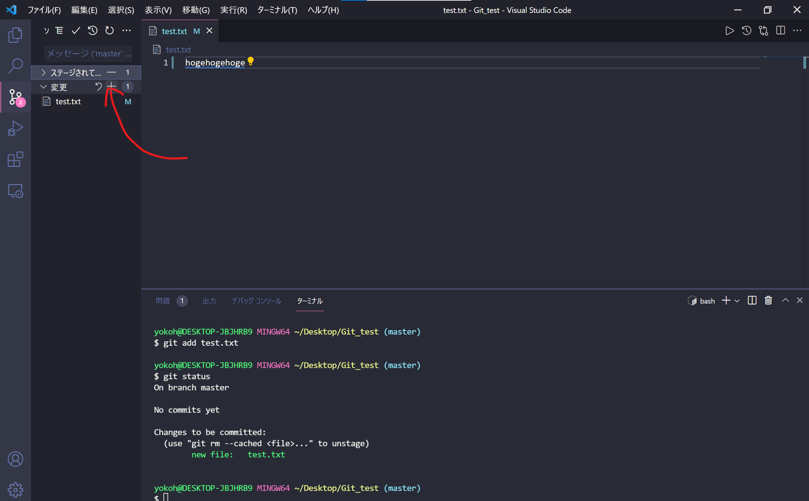

# コミット
ステージに上げた内容をGitにアップロードする作業.
- `git commit` : コミットできる(ターミナル上でコッミットメッセージを編集)
- `git commit -m "メッセージ"` :　メッセージ付きコミット
- `git commit -v` : 変更内容を確認できる
- `git commit --amend` : 直前のコミットを修正できる.(pushしたコミットをやり直したらだめ)
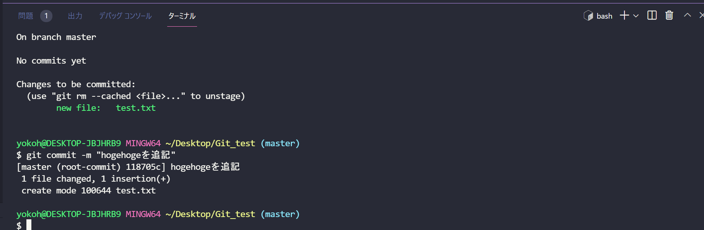

この作業をVSCodeの拡張機能を用いて行うならば以下のようにコミットメッセージを入力することでできる.
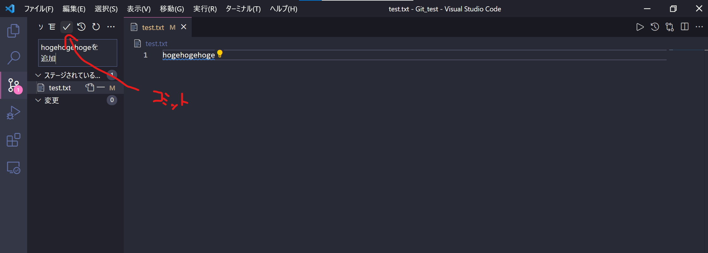

# リモートとローカルを結びつける
これからGitHubにアップロードし, リモートとローカルの両方でディレクトリを管理するためにGitHubとローカルのGitを結びつける.
## GitHubにリポジトリを作成する.
[GitHub](https://github.co.jp/)にログインし, 以下のように, GitHub上でリポジトリを作成する.
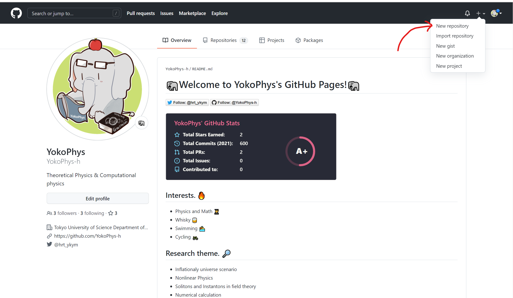

すると以下のような画面に移行するので, 適当なリポジトリ名を入力し, Descriptionには(記入しなくても良いが)そのリポジトリがどんなものなのか書いておくとよい. PublicにするかPrivateにするかはお好みで. (研究データとか社内情報とかをPublicにすると大変なことになるので注意.)
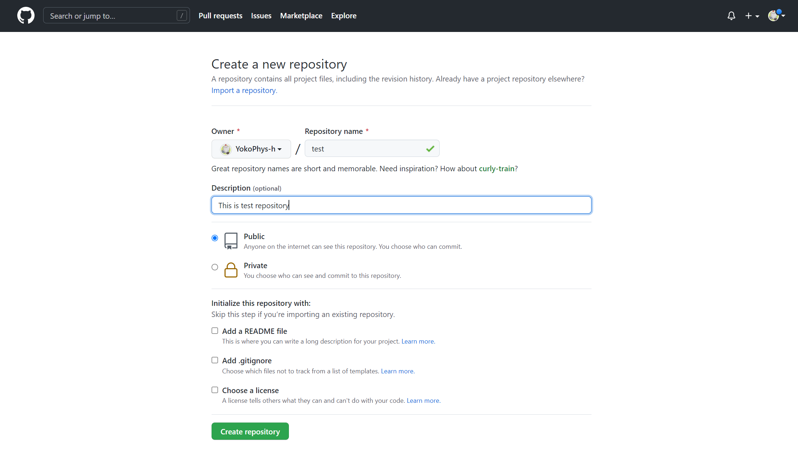

Create repositoryをクリックし, HTTPによる通信になっていることを確認して(HTTPとSSHについて細かいことは省く.), そのリンクをコピーしておく.
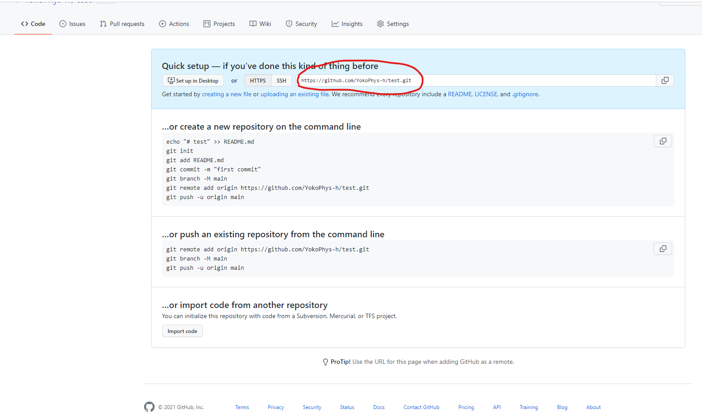

## リモートリポジトリのURLをローカルリポジトリに登録.
- `git remote add origin <URL>` : originというショートカットでurlのリモートリポジトリを登録する.
- `git remote -v`: 現在結びつけているリポジトリを確認できる.

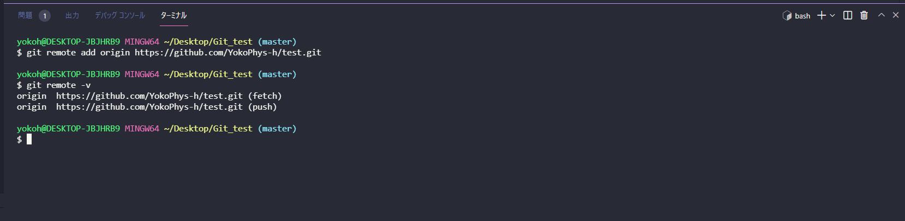

# リモートにコミットした内容をpush
ローカル(Git)でコミットした内容をリモート(GitHub)にアップロードする. -uオプションをつけておくと, 今後origin masterの文言が必要なくなるのでしておくと良い. (以下の記載では全て省略している.)
- `git push origin master` : ローカルリポジトリの内容をリモートリポジトリにpush
- `git push -u origin master` : 次回以降,git pushのみでpushできる.

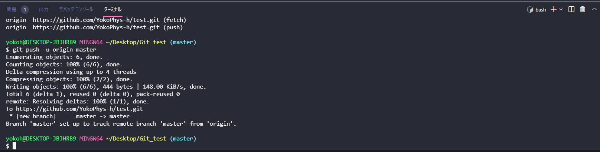
実際にGitHubのリポジトリページをリロードするとたしかにアップロードできていることが確認できる.
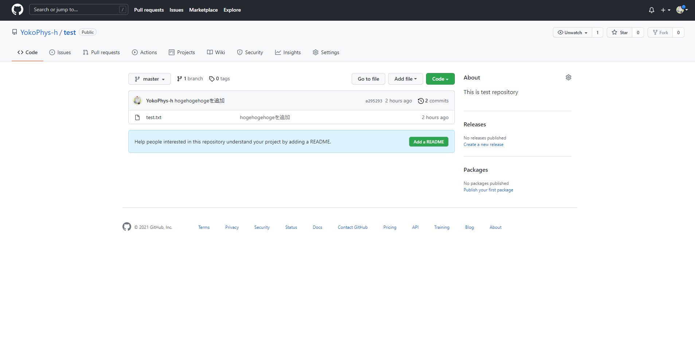

# Gitにコミットした履歴の管理について
これまでGitにコミットした履歴を確認し, 何を変更したかを理解し, もしもとに戻したい場合には履歴を遡って復元することができる.
- `git log` : 変更履歴を確認できる
- `git log --oneline` : 一行で変更内容を確認できる
- `git log -n コミット数`: 表示する履歴コミット数を指定できる.
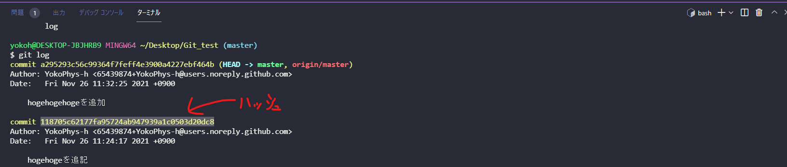

なお, この操作はVSCodeにgit historyの拡張機能を入れていれば視覚的にわかりやすく, そこからハッシュ値をしゅとくすることも可能.
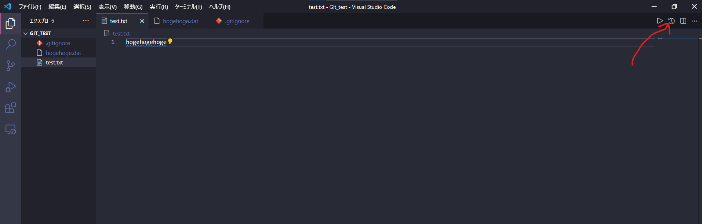
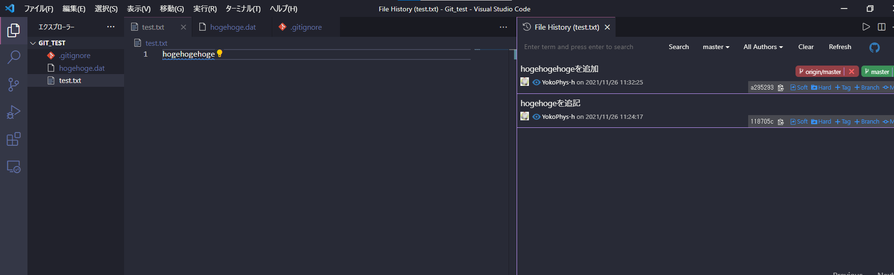

## 確認した履歴からコードの変更をもとに戻したい場合
- `git reset --hard <ハッシュ値>`: logコマンドから読み込んだハッシュ値からその地点へと変更を戻す. コミット, インデックス, ファイルの変更をすべて削除する.
- `git reset --mixed <ハッシュ値>`: コミット, インデックスを削除. ファイルの変更だけは残す.
- `git reset --soft <ハッシュ値>`: コミットだけを削除する. インデックス, ファイルの変更は残す.

先ほどの例で`git reset`コマンドを使って前のコミットに戻したが, 「実はその`git reset`は間違いだった」というときのコマンドも用意されている.
- `git reflog`: mergeやresetなどすべての情報を含む履歴を確認できる.
- `git reset --hard HEAD@{番号}`: 番号の地点へ戻れる.

## README.mdページについて
GitHubにおいてPublicでオープンソースにする際には`README.md`というMarkdown形式のファイルを作成しておくとよい. そうするとそのリポジトリを開いたときに何が記載されているのかが読者にとって(自分にとっても)理解しやすくなる. GitHubはREADME.mdページをpushされると, 自動的にトップページとしてリポジトリに表示してくれる. (この記事みたいに.)

## .gitignoreファイルについて
自分のローカルのリポジトリ内に`.gitignore`というファイルを作っておくと, そこに記載したファイルをGit管理から外すことができる. (`git add .`コマンドでステージするときに便利.) ファイル名を素直に記載しても良いが, `*.hoge`のように記載することでその拡張子がついたファイルすべてをignoreすることができる. なお, 一度でもcommitしたファイルをignoreする場合には一度キャッシュの消去をする必要があるので, 注意.
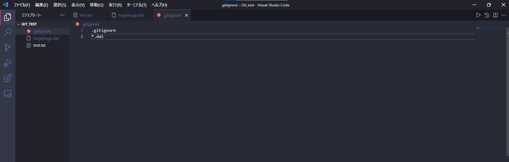

## リモートから情報を取得する
GitHub上にGit管理データを上げておくと, リポジトリを共同管理していたり, 別PCで作業するときに自分のフォルダに変更点のみとりこむことができる. 

## リモートから情報を取得する(pull)fetchのmasterとmergeする作業を一度にできる
- `git pull origin master` : fetch(情報の取り込み)とmerge(結合)を一度に行うことができる.

## 段階に分けて行う場合
- `git fetch origin` : リモート(github上で追加されたファイルを取得する)
- `git checkout master` : マスターブランチに戻る
- `git merge origin/master` : マスターブランチに取得した情報をmergeする
- `git branch -a` : git branchのすべての情報を表示する
- `git checkout <ブランチ名>` :　ブランチに移動する.(ブランチ名はgit branchコマンドで探す)
origin/masterとすればgithub上のmasterブランチをmerge,fetchできる。

# branchとmerge
新しいプロジェクトを試みようとしたり, 他の人と共同作業したりするときには, メインで動かしている場所で変更をすると既存のプロジェクトが動かなくなる場合があるので, メインではなくBranchに分けるという操作をすると良い.
- `git branch` : branchを表示(今いるbranchは*マークが付く)
- `git branch <ブランチ名>` :　新規ブランチの作成
- `git checkout <ブランチ名>` : ブランチの切り替え
- `git checkout -b <新規ブランチ名>` : 上２つの作業を一度に行いたい場合
- `git branch master origin/master` : github上のmasterをローカルのmasterとして作成
- `git merge <ブランチ名>` : Git上のブランチの内容を取り込む
- `git merge origin/<ブランチ>` : github上のブランチを取り込む
- `git branch -m <ブランチ名>` : 今いるbranchの名前を変更するとき
- `git branch -d <ブランチ名>` : branchの消去ができる(masterにmergeされていない場合は止まってくれる)
- `git branch -D <ブランチ名>` : branchの強制消去ができる

- `git rebase <ブランチ名>` : 別ブランチのcommitをブランチに取り込むことができる.(mergeをしながらcommitまでも取り込むことができる.
履歴を整えられる)
- `git config --global merge.ff false(true)` : falseにすればmergeするときもcommitメッセージを残すことができる.
なお、githubにプッシュしたコミットをリベースしてしまうのはだめ。

**作業の履歴を残したければmerge、履歴を消してきれいにしたければrebase**

# 既存のGitHubリポジトリの内容をコピーする.
自分や他者が作ったGitHubリポジトリの内容をローカルPCにコピーすることができる.

コピーしたいリポジトリに移動し, Cloneアドレスを取得し, cloneコマンドを実行する.

- `git clone <アドレス>` : ワークツリーと.gitディレクトリがコピーされる

# その他もろもろ
- `git diff <ファイル名>` : ファイルにおいてステージに上げた後の差分を表示
- `git diff --staged` : git addした後の差分を表示
- `git log` : 変更履歴を確認できる
- `git log --oneline` : 一行で変更内容を確認できる
- `git log -n コミット数` :表示する履歴コミット数を指定できる.
- `git rm <ファイル名>` : ファイルの消去
- `git em --cached <ファイル名>` : gitのワークツリーから消去したいがファイルは残したい場合
- `git mv <旧ファイル> <新ファイル>` : ファイルの移動ができる.

## コマンドにエイリアスをつける.
- `git config --global alias.ci commit` : commitするときにciと入力すれば済む
- `git config --global alias.st status` : statusのときstと入力すれば済む
- `git config --global alias.br brunch` : brunchのときbrと入力すれば済む
- `git config --global alias.co checkout` : checkoutのときcoと入力すれば済む

## 変更をもとに戻す(ctrl + Z的な)
- `git checkout -- <ファイル名>` : ファイルへの変更を取り消す
- `git checkout -- .` : 全変更の取り消し

## リモート名の変更,消去
- `git remote rename <旧リモート名> <新リモート名>` : リモート名の変更
- `git remote rm <リモート名>` : リモートの消去

## コミットに対してタグを作成する
- `git tag -a <タグ名> -m "メッセージ"` : メッセージ付きでタグを付ける
- `git tag <タグ名>` : メッセージなしでタグを付ける
- `git tag <タグ名> <コミット名>` : 後からコミットに対してタグ付けできる
- `git show <タグ名>` : タグの情報を表示する.
- `git push origin <タグ名>` : タグをリモートに送信する
- `git push origin --tags` : すべてのタグをリモートに送信する

## キャッシュについて(.gitignoreファイル作成時に便利)
- `git rm -r --cached <ファイル名>` : ファイルを残したまま、gitの管理から外す(キャッシュの消去). 既にcommitしてしまったファイルをあとからignoreしたい場合に使うと改めてignoreできる.

## GitHub Flowについて
GitHubでチーム開発をする際にはGitHub FlowというGitHub社が用いている共同開発フローを用いることが多い. その手順を以下に雑に書いておく.

### GitHub Flow
GitHub Flowは簡単にまとめると以下の手順で行われる.

1. 参加するプロジェクト(リポジトリ)を自身のローカルリポジトリにクローンする.
   
   `git clone <url>`

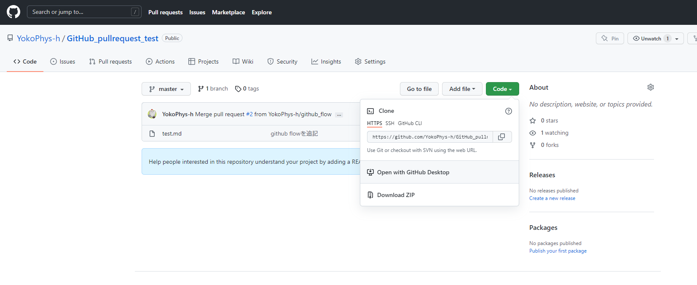

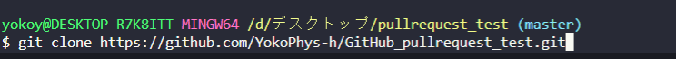

2. すると自動的にブランチにmasterブランチが形成されるが, masterブランチは常にデプロイできる状態にしておく必要があり, 未完成のコードをpushすべきではない. したがって, ブランチを分け, この上で共同作成者は作業をする.

`git checkout -b <hoge>`

3. 自身の上でpushしたいコードが出来上がったら(進捗の確認がし易いように定期的にpushはすべき), stage -> commit -> pushの一連の作業をする. このとき, pushするブランチの名前はmasterではなく現在使用しているbranch名を用いること.

`git add .`

`git commit -m "hogeを追加"`

`git push origin <ブランチ名>`

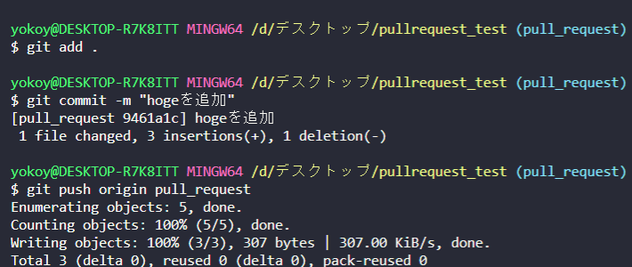

4. GitHub上で共同作成者にPull requestを送る. GitHubを開き, リモートで作業をしているリポジトリを開き, Pull requestsタブを開く. 
   
   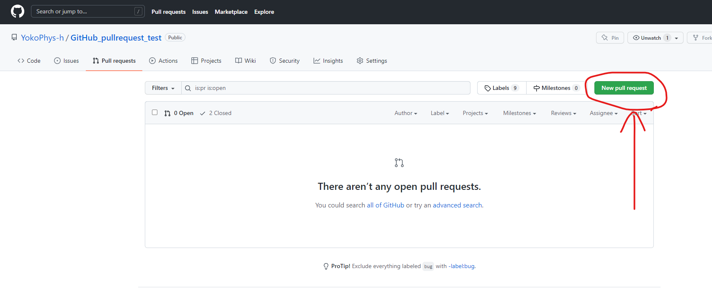

その後, New pull requestボタンを押し,　baseをmasterのまま, compareを先程pushしたブランチ名に選択する.

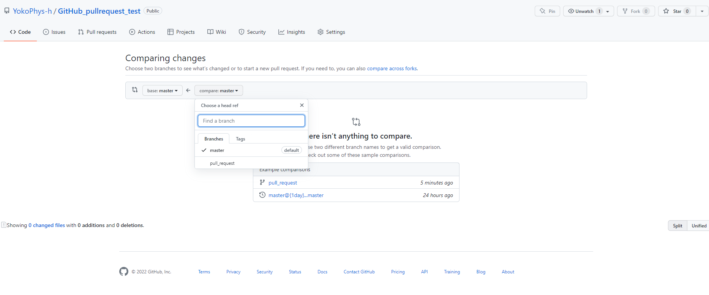

すると下図のようになるので, Create pull requestボタンを押す.(コードの部分にコメントを残すことも可能.)

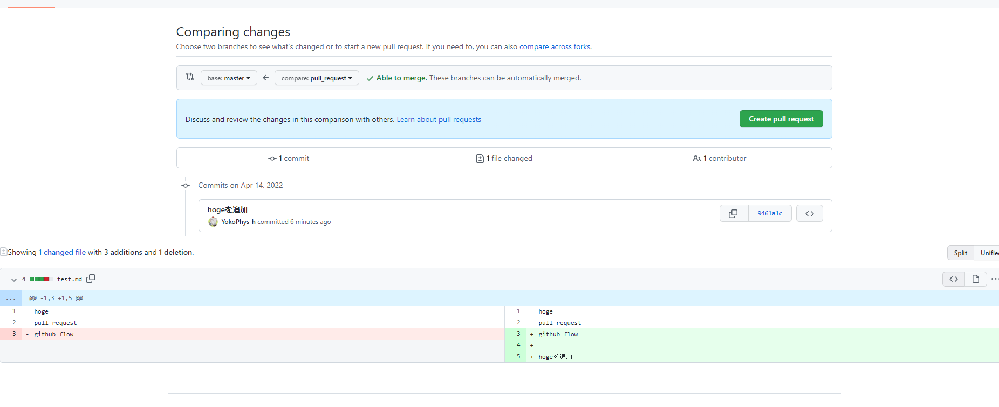

下記画面に移行するので, 説明や相手へのメッセージを記入し, Create pull requestをする.

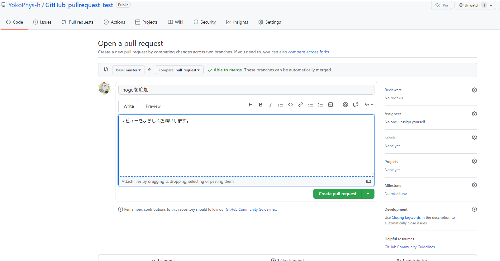

以上でpull requestは完了だが, 指定の共同作成社にレビューをお願いする場合(メール通知を飛ばす場合)Reviewersタブからユーザーを追加する.

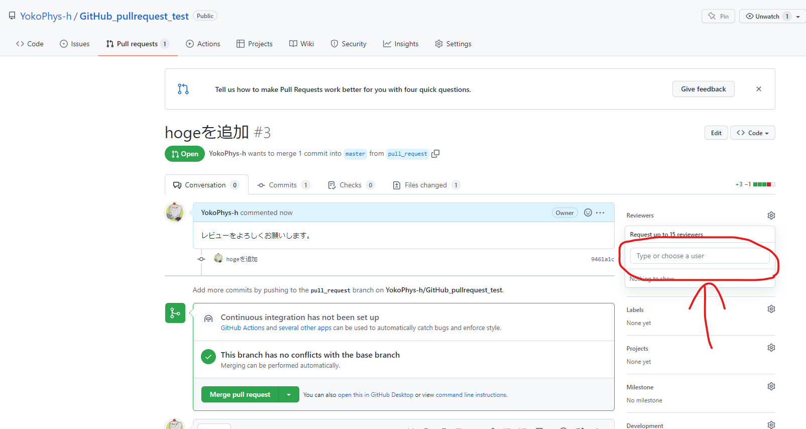

5. Pull requestのmasterブランチへの取り込み. プロジェクトの所有者は先ほどのpull requestページにてFiles changedを確認し, 問題なければMerge pull requestボタンを押す. 問題があればFile changedにおいてコメントを作成者にむけて飛ばす. なお, merge後にはpull requestされたブランチを消去しておくとよい.

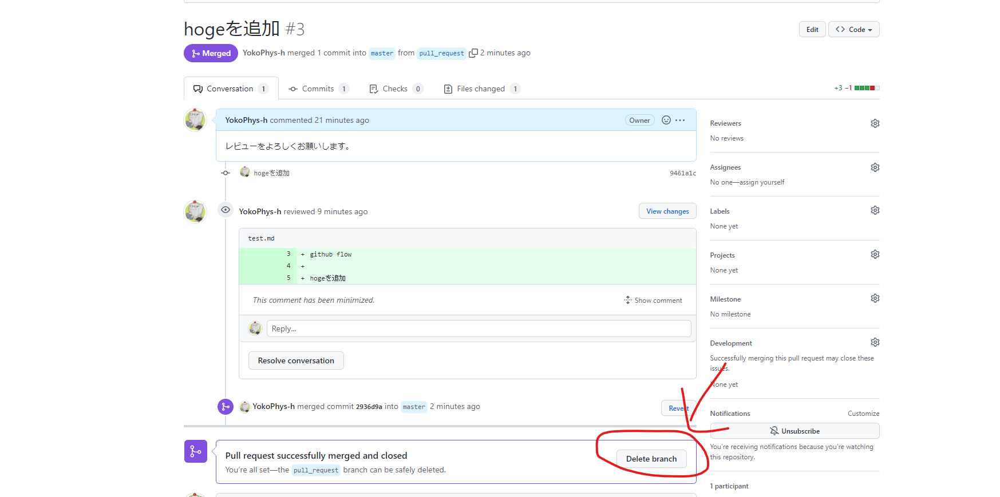

6. 先の操作でmaterが変更され, 自身のローカルに取り込むために, 分けた作業用ブランチからmasterブランチに移動し,　pullをする.

`git checkout master`

`git pull origin master`

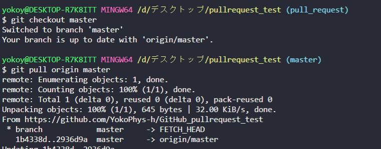

7. 最後に不要となったローカルのブランチを消去する.

`git branch -D <hoge>`

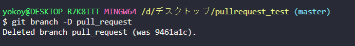

8. その後さらに開発を進める際には改めて1.から始める. (とにかくmasterブランチは常にデプロイ可能な状況にしておくことが大切らしい.)